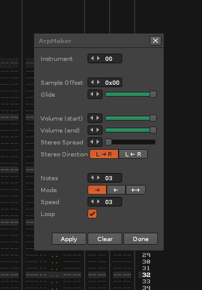
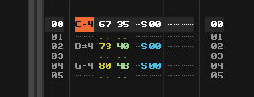

# Renoise Arp Maker

Simple Renoise tool for generating chiptune-style arpeggios using the phrase editor. Serves as a replacement for the `Axx` command, which is broken at higher lines-per-beat values.

# Installation

Download the latest release. Drag and drop the main folder into Renoise and the tool will be installed. For more details, see the [Renoise Tools page](https://www.renoise.com/tools).

# Usage

The tool can be found in the `Tools\ArpMaker` menu entry. With the tool window open, select the instrument you wish to use. Adjust the options and press `Apply` to generate arpeggios as phrases. In the pattern editor, use the `Zxx` command to specify which arpeggio phrase to play. For example, the `Z37` command will play a 037 arpeggio. This notation is the same as for the existing `Axx` command.

  
*Example of an arpeggio phrase*

**Note:** using this tool will overwrite all existing phrases for the selected instrument. If you accidentally apply arpeggios to the wrong instrument, just press `Undo` to restore the original phrases.

# Options

Several options are available for adjusting the properties of the generated arpeggio. These include:

| Name | Description | Values |
| --- | --- | --- |
| Instrument | Selects the instrument that will have arpeggios generated. | Any instrument number |
| Sample Offset | The Sample Offset value that will be applied to each note in the arpeggio. If Glide is active, offset will only apply to the first note. Same as the `Sxx` command. | `0x00 - 0xFF` |
| Glide | The Glide value that will be applied to each note in the arpeggio. Set to `0` to disable glide altogether. Same as the `Gxx` command. | `0 - 255` |
| Volume (start) | Volume of the first note in the arpeggio. Notes between start and end will use an interpolated volume value. | `0 - 80` |
| Volume (end) | Volume of the last note in the arpeggio. Notes between start and end will use an interpolated volume value. | `0 - 80` |
| Stereo Spread | Total stereo spread of the arpeggio. First and last notes of the arpeggio will have a panning value equal to the stereo spread value, to either the left or the right. Notes between start and end will use an interpolated panning value. | `0 - 40` |
| Stereo Direction | Specifies whether the notes of the arpeggio will pan from left to right, or from right to left. | `L → R` or `L ← R` |
| Notes | Number of notes in the arpeggio before it either loops or ends. | `3 - 12` |
| Mode | Specifies whether the pitch of notes in the arpeggio will rise, fall, or rise and then fall. | `→`, `←`, or `⟷` |
| Speed | Speed of the arpeggio, specified as a multiplier of the default lines per beat of the song. This will use the current value in the `LPB` field when the arpeggio is created. | `1x - 9x` |
| Loop | Specifies whether the arpeggio should loop or not.  | Loop `on` or `off` |
